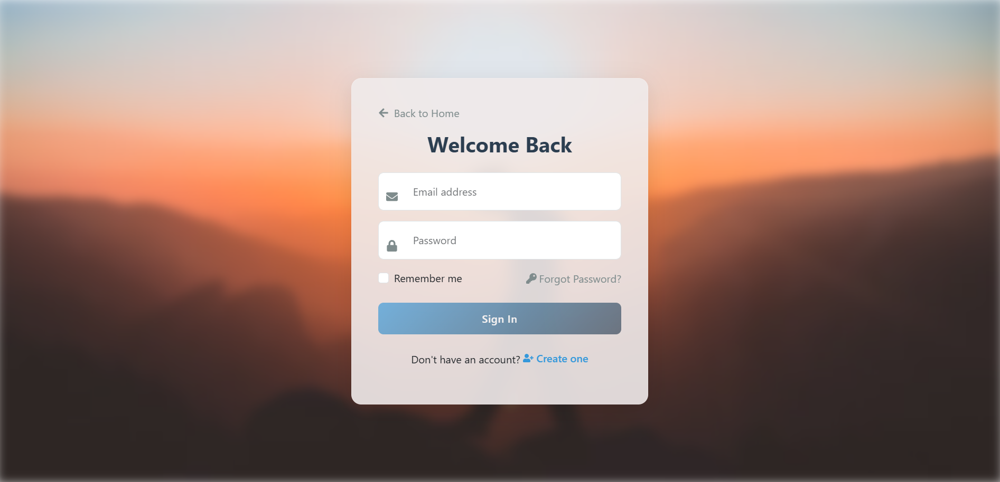

# ✈️ Travel Itinerary Planning Tool

A full-stack Travel Planner App to manage your trips, collaborate with friends, and track expenses in a simple and interactive way.

---

## 🔗 Live Demo

🌐 **Frontend**: [https://travel-itinerary-planning-tool.vercel.app/](https://travel-itinerary-planning-tool.vercel.app/)

---

## 🚀 Features

### 🔐 Authentication

- Signup and login using email/password with OTP verification
- JWT-based secure routes for protected APIs

### 🧳 Trip Management

- Add, view, and delete trips
- View detailed trip info (destination, duration, notes, cost)
- Auto-calculates duration from start and end dates
- Auto-updates total trip cost based on added expenses

### 👥 Collaboration

- Invite users to collaborate on a trip via email
- Collaborators can accept or reject invitations
- Real-time tracking of invite status

### 💰 Expense Tracking

- Add expenses by category (Food, Travel, Accommodation, Shopping, Other)
- Each expense is tied to a specific trip
- Track how much each trip costs
- `totalCost` updates dynamically with every new expense

### 📱 Responsive UI

- Clean and modern design
- Mobile-friendly and works on all screen sizes

---

## 📁 Tech Stack

### 🧠 Frontend

- React.js
- React-Bootstrap
- React Router
- Redux Toolkit
- Axios
- Framer Motion

### 🛠 Backend

- Node.js
- Express.js
- MongoDB with Mongoose
- JWT Authentication
- Nodemailer (for OTP & invitation emails)
- CORS, dotenv, bcrypt

---

## 🛠 How to Use Locally

### 1. Clone the Repository

```bash
git clone https://github.com/RahulkrWD/Travel-Itinerary-Planning-Tool.git
cd Travel-Itinerary-Planning-Tool
```

```bash
cd backend
npm install

PORT=5000
MONGO_URL=your_mongodb_connection_string
JWT_SECRET=your_jwt_secret
CLIENT_URL=http://localhost:5173
USER_EMAIL=your_email_for_nodemailer
USER_PASS=your_email_password_or_app_password
npm start
```

```bash
cd frontend
npm install

VITE_API_URL=http://localhost:5000
npm run dev
```

# Screenshots





